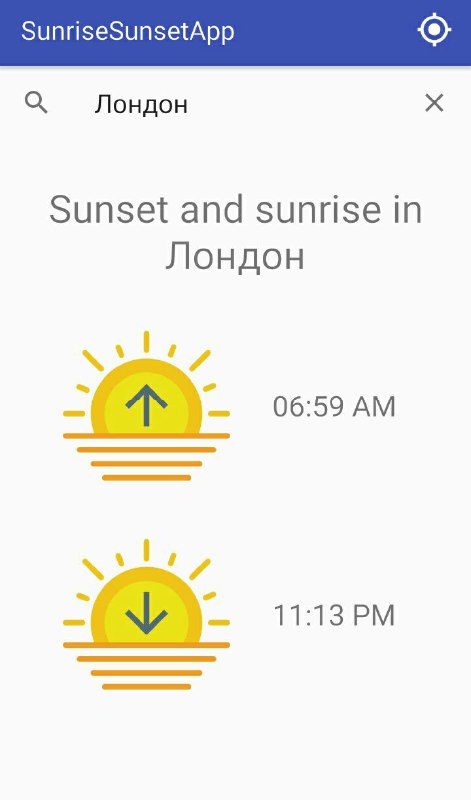
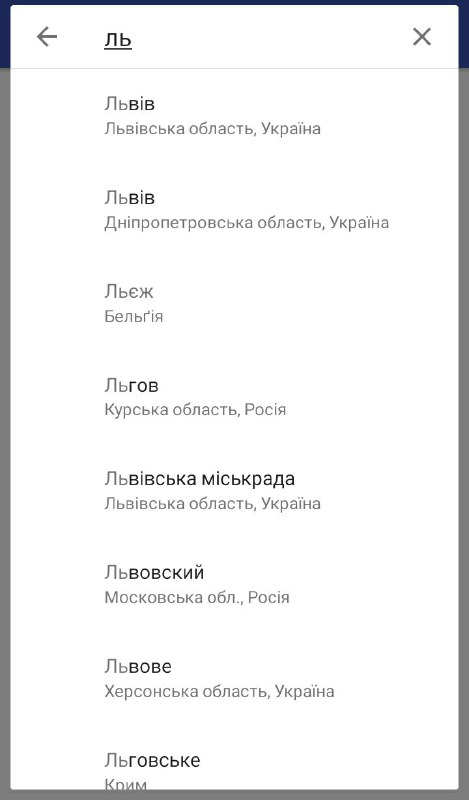
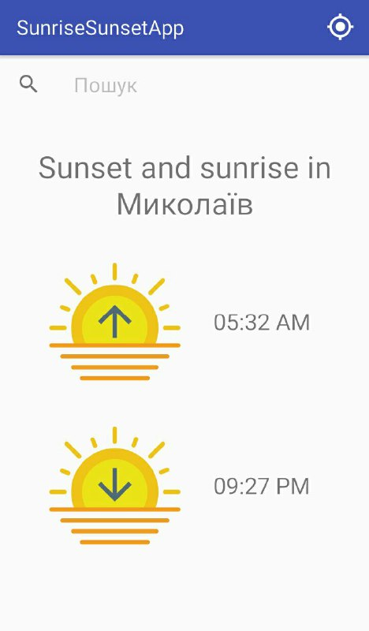

# SunriseSunsetApp

Using [API](https://sunrise-sunset.org/api) and Google Places API.

## Project description
Implemeted use-cases:
* User can view the sunrise/sunset information for his current location
* User can view search for any city and view the sunrise/sunset information for this city

## Screenshots:
Search | Search fragment | Info for current location
-------------|----------------- | -------------
  |  | 

## Used libraries

* com.squareup.retrofit2:retrofit:2.4.0 
* com.squareup.retrofit2:converter-jackson:2.4.0 - working with JSON object.

   Coroutines
* org.jetbrains.kotlinx:kotlinx-coroutines-android:0.23.4'
* com.jakewharton.retrofit:retrofit2-kotlin-coroutines-experimental-adapter:1.0.0'

  Play services
* com.google.android.gms:play-services-maps:15.0.1'
* com.google.android.gms:play-services-places:15.0.1'

## License
This application is Free Software ([GNU General Public License](https://www.gnu.org/licenses/gpl.html)).
